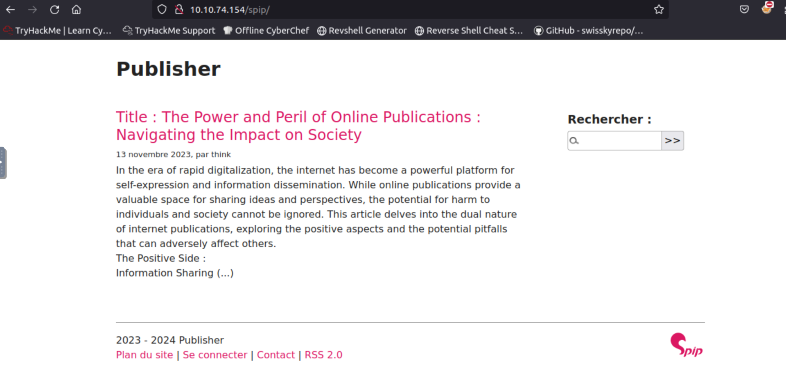

# Write-up

This is the write-up for Publisher challenge room from try hack me.


[Publisher Room Link(https://tryhackme.com/r/room/publisher)](https://tryhackme.com/r/room/publisher)

First I used the nmap to know which ports are opened. Only 22 and 80 ports are open


Used gobuster to get the directories.


This page is using spip and search on google for RCE.



Found out these two links for RCE.
[exploit-db (https://www.exploit-db.com/exploits/51536)](https://www.exploit-db.com/exploits/51536)
[github (https://github.com/nuts7/CVE-2023-27372)](https://github.com/nuts7/CVE-2023-27372)

Created the file and tried to put on server using curl. Failed to put the file using curl or wget.


Tried to check the paylod in manual using burpsuite and confirmed that payload is working.


Tried to write a file to the server.


Write reverse shell from penterster money.


Activated the reverse shell `curl http://10.10.74.154/spip/welcome.php` and got the reverse shell.


Got id_rsa and log in as think user.


Tried to find suid and /usr/sbin/run_container is interesting.


Tried to run suid file.


Tried to replace /opt/run_container.sh file and permission denied.
```
think@publisher:~$ echo " chmod u+s /bin/bash" >> /opt/run_container.sh
-ash: /opt/run_container.sh: Permission denied
think@publisher:~$ echo $SHELL
/usr/sbin/ash
```

The error output showing that the shell we got is ash shell. As per the hint "Look to the App Armor by it's profile.", checked the ash profile inside /etc/appmor.d directory.

```
think@publisher:/etc/apparmor.d$ cat usr.sbin.ash
#include <tunables/global>

/usr/sbin/ash flags=(complain) {
  #include <abstractions/base>
  #include <abstractions/bash>
  #include <abstractions/consoles>
  #include <abstractions/nameservice>
  #include <abstractions/user-tmp>

  # Remove specific file path rules
  # Deny access to certain directories
  deny /opt/ r,
  deny /opt/** w,
  deny /tmp/** w,
  deny /dev/shm w,
  deny /var/tmp w,
  deny /home/** w,
  /usr/bin/** mrix,
  /usr/sbin/** mrix,

  # Simplified rule for accessing /home directory
  owner /home/** rix,
}
```

`deny /opt/** w` means that deny write permission to any file or directory in or below /opt. That's why we can't modify the /opt/run_container.sh file. So we need to find a way to get normal bash shell.

`deny /var/tmp w` means that deny write permission to only /var/tmp file. So we still have write permission inside /var/tmp folder.

We noticed that when we ran the /opt/run_container.sh, there is an error `/opt/run_container.sh: line 16: validate_container_id: command not found` . So how about create the binary file named as `validate_container_id` under /var/tmp directory and write reverse shell on it. Give execute permission and add /var/tmp to $PATH. So it will execute when calling /opt/run_container.sh.


Got the reverse shell as normal bash shell.


[](https://youtu.be/v7__S5J9Vvk)
